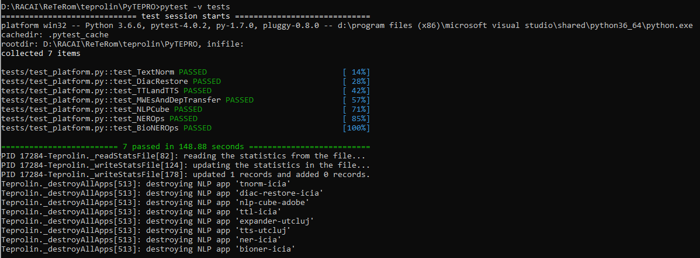

# DO NOT USE, IN TRANSIT!
Please wait before this section goes away, before using it!

# Teprolin
**Teprolin** is a `Python` platform for text pre-processing that has been developed in the [Teprolin project](http://www.racai.ro/p/reterom/).
It is described in the following paper ([click to read it from the conference proceedings](https://profs.info.uaic.ro/~consilr/wp-content/uploads/2019/06/volum-ConsILR-2018-1.pdf)):

**Ion**, **Radu**. (2018). _**TEPROLIN**: An Extensible, Online Text Preprocessing Platform for Romanian_. In Proceedings of the International Conference on Linguistic Resources and Tools for Processing Romanian Language (ConsILR 2018), November 22-23, 2018, Iași, România.

## Installation
**Teprolin** only works with `Python 3` and it has been tested with `Python 3.6` on `Windows 10` and with `Python 3.5` on `Linux Ubuntu 16.04/xenial`. **Teprolin** includes the [**TTL** text pre-processor](http://www.racai.ro/media/WSD.pdf) which runs in `Perl`. In Windows, we used [Strawberry Perl](http://strawberryperl.com/) and in Ubuntu, the default `perl` installation.

### TTL
To make sure **TTL** works, issue the following commands in a `perl`-enabled command prompt (`perl` has to be in `PATH`):

`cpan install Unicode::String`

`cpan install Algorithm::Diff`

`cpan install BerkeleyDB`

### NLP-Cube
[NLP-Cube](https://github.com/adobe/NLP-Cube) has its own repository at GitHub. Just issue the following command:

`pip3 install nlpcube`

### TTS Frontend
SSLA is a Text-To-Speech library developed by Tiberiu Boroș et al.
Read about it on [arXiv](https://arxiv.org/pdf/1802.05583.pdf). The source code can be found on GitHub at [SSLA](https://github.com/racai-ai/ssla).
MLPLA is the text preprocessing front-end for SSLA and it is used in TEPROLIN for:
- word hyphenation
- word stress identification
- phonetic transcription

Additionally, we ported some code from our [ROBIN Dialog Manager project](https://github.com/racai-ai/ROBINDialog) to do numeral rewriting, also for the benefit of TTS tools.
In order to run MLPLA, you need a recent (e.g. 14, 15) Java Runtime Engine installed and available in `PATH`.

If you want to build the MLPLAServer yourself, install the MLPLA text text preprocessing library in your local Maven repository by running this command:

`mvn install::install-file -Dfile=speech\mlpla\MLPLA.jar -DgroupId=ro.racai -DartifactId=mlpla -Dversion=1.0.0 -Dpackaging=jar -DgeneratePom=true`

### Other dependencies
Please install these packages as well:

`pip3 install filelock`

### Teprolin resource files
The resource files are models, lexicons, mapping files, etc. that are loaded by all NLP apps of Teprolin.
They sit in the `.teprolin` folder, under your home folder.
In `Windows 10` this is `%USERPROFILE%` and in `Linux`, `~`. Contact @raduion for the files.

### Testing
If you want to test the installation, please install `pytest` first:

`pip3 install pytest`

Then, issue `pytest -v tests` from the root of this repository.
Please be patient, it will take a bit:

### Running the REST web service
You'll have to install `Flask` and `Flask-RESTful` Python 3 packages and the `uwsgi` web server (only on Linux):

`pip3 install flask`

`pip3 install flask-restful`

Then, run the following command from the root of this repository:

`python TeproREST.py`

to start the server in the foreground, with a single-process, in development mode.

To install all the related Python 3 packages in two commands, using a virtual environment, do this:

`python3 -m venv /path/to/new/virtual/environment`

then activate the new environment executing the `source /path/to/new/virtual/environment/bin/activate`. Finally, run

`pip3 install -r requirements.txt`

**Only on Linux**: to start/stop the server in production mode using `uwsgi` for the RELATE platform, do this:

`pip3 install uwsgi`

`start-ws.sh`

`stop-ws.sh`

**Note**: Before running the above-mentioned scripts, you **HAVE** to remove the Windows-specific and Flask code from
[TeproREST.py](TeproREST.py) file; just read the associated comments and delete the lines.

To start the server on three different ports for faster, multi-threaded processing, do this:

`start-ws-mt.sh`

`stop-ws-mt.sh`
